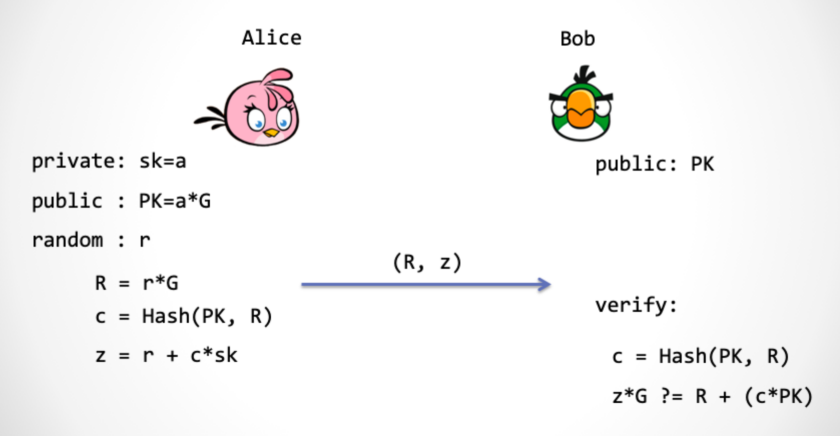

## 1. zkp的三个特性  
- 完备性（completeness）。如果证明方和验证方都是诚实的，并遵循证明过程的每一步，进行正确的计算，那么这个证明一定是成功的，验证方一定能够接受证明方。  
- 合理性（soundness）。没有人能够假冒证明方，使这个证明成功。  
- 零知识性（zero-knowledge）。证明过程执行完之后，验证方只获得了“证明方拥有这个知识”这条信息，而没有获得关于这个知识本身的任何一点信息。

## 2. Schnorr protocol

## 3. Noninteractive Schnorr protocol
用 [Fiat-Shamir](https://en.wikipedia.org/wiki/Fiat%E2%80%93Shamir_heuristic) 协议，把整个协议压缩成一步交互。  
Fiat-Shamir的基本原理是用一个`hash`来代替随机数，从而实现非交互式证明。在这个例子中即`c=Hash(PK,R)`。

## 4. Schnorr 签名
在 NI-Schnorr 的基础上来实现对消息`m`的签名，令`c=Hash(PK,R,m)`，然后发布`(R,z)`作为对消息`m`的签名。  
验签逻辑为 $z·G=R+c·PK$  

## 5. Schnorr 聚合签名
### 基本原理
一组公钥共 N 把，签名后得到 N 个签名。这 N 个签名可以相加最终得到一个签名。这个签名的验证通过，则代表 N 把公钥的签名全部验证通过。
### 基本流程
现有：
- 椭圆曲线：G
- 待签名的数据：m
- 哈希函数：Hash()
- 私钥：sk1, sk2
- 公钥：PK1=sk1·G, PK2=sk2·G
- 随机数：r1, r2，并有 R1=r1·G, R2=r2·G
- 组公钥：PK=PK1+PK2

则有：
- 私钥 sk1 和 sk2 的签名为：(R1, z1), (R2, z2)。
- 两个签名相加得到组签名：(R, z)。其中：R = R1 + R2, z = z1 + z2。

验签逻辑为 $z·G=R+c·PK$

> 组公钥 (Group Key) 又称聚合公钥 (Aggregation Key)，需要指出的是，参与方需要先相互交换公钥和R值，然后再进行各自的签名。

### 应用  
若使用在比特币上，相比 ECDSA 会有一些额外的显著优势：
- 更安全。目前 Schnorr 签名有[安全证明](https://www.di.ens.fr/david.pointcheval/Documents/Papers/2000_joc.pdf )，而 ECDSA 目前并没有类似的证明。
- 无延展性困扰。ECDSA 签名是可延展性的，第三方无需知道私钥，可以直接修改既有签名，依然能够保持该签名对于此交易是有效的。比特币一直存在延展性攻击，直到 SegWit 激活后才修复，前提是使用 segwit 交易，而不是传统交易。[BIP62](https://github.com/bitcoin/bips/blob/master/bip-0062.mediawiki ) 和 [BIP66](https://github.com/bitcoin/bips/blob/master/bip-0066.mediawiki ) 对此有详细描述。
- 线性。Schnorr 签名算法是线性的！这点非常牛逼，基于这点可衍生出许多应用。例如，N 个公钥进行签名，采用 ECDSA 的话，则有 N 个签名，验证同样需要做 N 次。若使用 Schnorr，由于线性特性，则可以进行签名叠加，仅保留最终的叠加签名。例如同一个交易无论输入数量多少，其均可叠加为一个签名，一次验证即可。以及 GMaxwell 提出的 Taproot/Grafroot 也是基于其线性特性。

### 不足
1. 多重签名需要多次（签名者之间的）通信，这对冷钱包来说过于麻烦。
2. 聚合签名算法依赖随机数生成器，而不像 ECDSA 那样可以使用指定的随机点（R）。
3. m of n 多重签名机制比较取巧，需要构建公钥的默克尔树。当 m 和 n 较大时，树所占空间会相当大。
4. 无法把一个区块中的所有签名聚合成一个签名（BLS 签名可以实现）。

### Q&A  
Q: Schnorr 签名是否可以用在 m of n 多重签名上？  
A: 当然可以。多重签名只是 m of n 的签名数量的模式。与签名算法无关。  

Q: Schnorr 的组签名特性是否可以做或模拟出 m of n 式的签名？  
A: 无法做到。组内有 N 把公钥，则必须对应有 N 个签名，缺一不可。每个人在生成签名的时候，在哈希函数里都代入的都是组公钥 P。  

Q: 签名机制的安全性如何衡量？  
A: 主要取决于两个： 
  1. 椭圆曲线。目前，Schnorr 与 ECDSA 都用的是曲线 secp256k1，这个层面一样。
  2. 签名算法本身。Schnorr 目前有安全证明，安全优于 ECDSA。

## 6. BLS 签名
BLS 首先对 hash 算法做了不同的处理。Schnorr 签名算法中结果（哈希值）是数字。BLS 签名算法略微修改了哈希算法，结果对应到椭圆曲线上的一个点。最简单的修改是：哈希函数保持不变，将得到的哈希值作为点的 x 值寻找椭圆曲线上的对应点。
> 通常来说（比如比特币所用的曲线），椭圆曲线有 $2^{256}$ 个点，而 SHA-256 哈希算法的值也恰好是 256 位。不过，一个有效的 x 坐标，会对应一正一负两个 y 坐标（因为（x, y）和（x, -y）都是曲线 $y^2=x^3+ax+b$上的点）。换句话说，新的哈希算法大约有 50% 的概率在曲线上找到 2 个对应点，另 50% 的概率则一个点也找不到。  
> 对消息求哈希时，为确保能在曲线上找到对应的点，可以在消息体后附加一个数，若在曲线上没有对应点则累加该数并重新计算。即如果 Hash(m,0) 没有找到对应点，则持续尝试 Hash(m,1), hash(m,2)等，直到找到为止。当找到对应点后，在 2 个点中选择 y 坐标较小的那个作为结果即可。

现有:
- 椭圆曲线: G
- 椭圆曲线生成元: $G_0$
- 待签名的数据: m
- 哈希函数: $H(m) \rightarrow G_m \quad G_m \in G$
- 私钥: sk
- 公钥: $PK=skG_0$
- 双线性映射: e, 且有 e(x*P,Q)=e(P,x*Q)

$Sign(sk,m) \Rightarrow \sigma=sH(m) \in G$  
$Verify(PK,m,\sigma) \Rightarrow Check\ that:\ e(PK,H(m))=e(G_0,\sigma)$  

